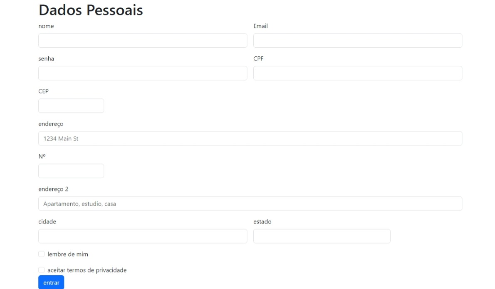

# Página de Login
 
## Descrição
Este projeto pocura emular o sistema de login de um site para o aprendizado do desnvolvedor
 
## Fontes utilizadas
*`Bootstrap5` 
 
## Tecnologias utilizadas
*`HTML5` 
*`CSS3` 
*`Git` 
*`Github` 
 
## Projeto
 
## Ferramentas utilizadas
* `VScode`
 
## Matérias utilizadas para a produção do site
Fundamentos de Desenvolvimento Web: 
Professor [Leonardo](https://github.com/leonardorochamarista) 
 
# Autores
Daniel felipe rezene